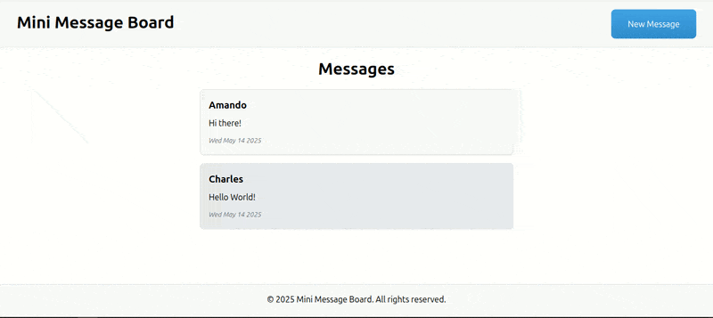
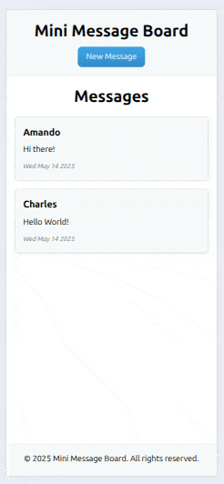

# Mini Message Board

A simple app using Node.js and Express, with EJS templates to render views when users make GET and POST requests.

## Model

| Desktop                                                          | Mobile                                                        |
| ---------------------------------------------------------------- | ------------------------------------------------------------- |
|  |  |

## Project Highlights:

- Users can make POST requests to add their messages to the messages array and display them on the app.
- Error handling that is user-friendly and prevents the app from breaking.
- Using `randomUUID()` for each message to help view them individually and `find()` them in the array of messages.
- Using middleware to store and handle the messages array.

## Challenges Overcome:

- How to pass the array around the app to access it.
- Error handling correctly throughout the app.
- Displaying the individual messages.
- Sending POST requests to the app and handling them.
- Displaying the Date in the correct format.

## New Skills Acquired:

- Error handling.
- Passing an array using middleware.
- Correctly separating an Express app into view, controller and routes.
- Using `randomUUID()` to give messages their own ID.
- Using EJS and templating the whole app.
- `toDateString()` to format the date.

## Technologies Used:

- HTML
- Node.js
- JavaScript
- Express
- EJS

## How to Clone

To clone this project to your local machine, follow these steps:

1. Open your terminal and navigate to the directory where you want to clone the project.
2. Run the following command:

   ```bash
   git clone https://github.com/SReddy-96/TOP-mini-message-board.git
   ```

3. Navigate into the project directory:

   ```bash
   cd TOP-mini-message-board
   ```

4. Install dependencies and start the server:

   ```bash
   npm install
   node app.js
   ```

5. Open your browser and navigate to `http://localhost:3000` (or the port specified in your .env file).

## Database Integration

Following the initial project, I enhanced the application by replacing the in-memory messages array with a PostgreSQL database. Environment variables are managed through a `.env` file in development, while using Render's PostgreSQL service in production with equivalent variables.

**The upgrade presented several challenges:**

- Creating scripts to populate both development and production databases
- Implementing database queries and controllers
- Integrating database results with the view layer

**Key learnings included:**

- The importance of securing sensitive information using environment variables
- Proper configuration of connection pools for database management
- Creating and testing database population scripts
- Setting up and deploying to Render's production environment
